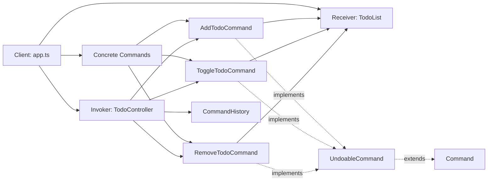
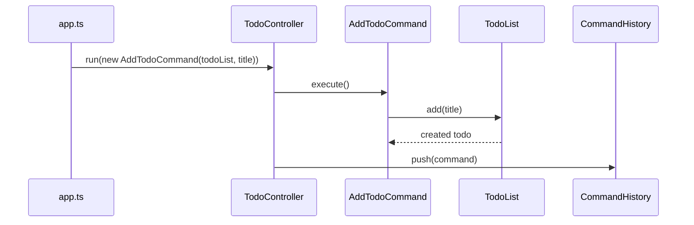
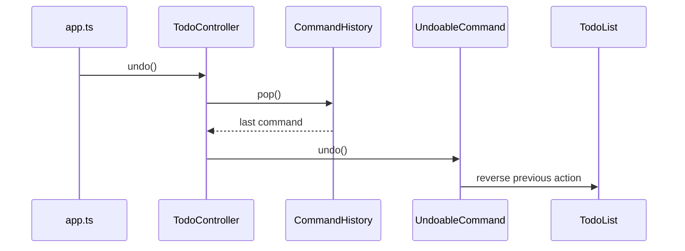

# Command Pattern Notes for Todo App

## Run the implementations

Install dependencies first:

```bash
npm install
```

Run the basic todo list implementation:

```bash
npm run basic
```

Run the command pattern implementation:

```bash
npm run command
```

## 1. Problems Without the Command Pattern

An action like “add todo” is not represented as an object.

So it is harder to:

- queue actions
- log actions
- undo actions
- store macros
- treat all actions uniformly

## 2. Problem: UI Actions and Business Actions Are Not Separated Well

If later you have:

- button clicks
- menu items
- keyboard shortcuts
- API endpoints

all of them must know how to call the app directly.

That is exactly the kind of situation where the Command pattern helps.

## 3. Command Pattern Roles in This App

### 3.1 Command

An object that represents a request.

Example:

- `AddTodoCommand`
- `ToggleTodoCommand`
- `RemoveTodoCommand`

Each command has an `execute()` method.

### 3.2 Receiver

The real object that knows how to do the work.

In our case:

- `TodoList`

It knows how to add, toggle, remove, and list.

### 3.3 Invoker

The object that triggers commands.

In our case:

- `TodoController`

It does not know how to add a todo itself.
It only receives a command and executes it.

### 3.4 Client

The code that wires everything together.

In our case:

- `app.ts`

It creates the receiver, commands, and invoker.

## 4. Implementation Steps

### 4.1 Step 3: Create the Shared Model

```ts
export interface Todo {
  id: number;
  title: string;
  completed: boolean;
}
```

### 4.2 Step 4: Create the Receiver

```ts
import { Todo } from "../models/Todo";

export class TodoList {
  private todos: Todo[] = [];
  private nextId = 1;

  add(title: string): Todo {
    const todo: Todo = {
      id: this.nextId++,
      title,
      completed: false,
    };

    this.todos.push(todo);
    console.log(`Added: "${title}"`);
    return todo;
  }

  remove(id: number): Todo | null {
    const index = this.todos.findIndex((t) => t.id === id);

    if (index === -1) {
      console.log(`Todo with id ${id} not found.`);
      return null;
    }

    const removed = this.todos.splice(index, 1)[0];
    console.log(`Removed: "${removed.title}"`);
    return removed;
  }

  insertAt(todo: Todo, index: number): void {
    this.todos.splice(index, 0, todo);
    console.log(`Restored: "${todo.title}"`);
  }

  findIndexById(id: number): number {
    return this.todos.findIndex((t) => t.id === id);
  }

  toggle(id: number): boolean {
    const todo = this.todos.find((t) => t.id === id);

    if (!todo) {
      console.log(`Todo with id ${id} not found.`);
      return false;
    }

    todo.completed = !todo.completed;
    console.log(`Toggled todo ${id}`);
    return true;
  }

  getTodoById(id: number): Todo | undefined {
    return this.todos.find((t) => t.id === id);
  }

  list(): void {
    console.log("\nTodo List:");
    if (this.todos.length === 0) {
      console.log("No todos yet.");
      return;
    }

    for (const todo of this.todos) {
      const status = todo.completed ? "[x]" : "[ ]";
      console.log(`${status} ${todo.id}. ${todo.title}`);
    }
  }
}
```

#### Why This Class Is Called the Receiver

Because this is the object that actually knows how to perform the business operations.

The command object does not contain the full business logic.
It delegates the real work to the receiver.

### 4.3 Step 5: Define the Command Interfaces

```ts
export interface Command {
  execute(): void;
}
```

`src/command/commands/UndoableCommand.ts`

```ts
import { Command } from "./Command";

export interface UndoableCommand extends Command {
  undo(): void;
}
```

#### Why Use Interfaces Here

Because every command should follow the same contract.

That means the invoker can say:

“I do not care whether this is add, remove, or toggle.
If it is a command, it must have `execute()`.”

That is one of the biggest ideas in design patterns:
different objects can be treated in the same way if they share the same interface.

### 4.4 Step 6: Add Command History

`src/command/history/CommandHistory.ts`

```ts
import { UndoableCommand } from "../commands/UndoableCommand";

export class CommandHistory {
  private history: UndoableCommand[] = [];

  push(command: UndoableCommand): void {
    this.history.push(command);
  }

  pop(): UndoableCommand | undefined {
    return this.history.pop();
  }
}
```

#### Why History Exists

Because for undo, we need to remember which commands were executed.

This class is just a stack.

- `push()` stores a command
- `pop()` gets the most recent command

This matches undo behavior:
the last action done is the first action undone.

That is LIFO:
Last In, First Out.

### 4.5 Step 7: Implement Concrete Commands

`src/command/commands/AddTodoCommand.ts`

```ts
import { TodoList } from "../receiver/TodoList";
import { UndoableCommand } from "./UndoableCommand";

export class AddTodoCommand implements UndoableCommand {
  private createdTodoId: number | null = null;

  constructor(
    private todoList: TodoList,
    private title: string,
  ) {}

  execute(): void {
    const todo = this.todoList.add(this.title);
    this.createdTodoId = todo.id;
  }

  undo(): void {
    if (this.createdTodoId !== null) {
      this.todoList.remove(this.createdTodoId);
    }
  }
}
```

#### Important Idea

This command stores the created todo id after execution.

Why?

Because undo needs to know what to remove later.

So commands often store enough information to reverse themselves.

`src/command/commands/ToggleTodoCommand.ts`

```ts
import { TodoList } from "../receiver/TodoList";
import { UndoableCommand } from "./UndoableCommand";

export class ToggleTodoCommand implements UndoableCommand {
  constructor(
    private todoList: TodoList,
    private id: number,
  ) {}

  execute(): void {
    this.todoList.toggle(this.id);
  }

  undo(): void {
    // Toggling again restores previous state
    this.todoList.toggle(this.id);
  }
}
```

#### Why Undo Is Easy Here

Because toggle is reversible by doing the same operation again.

If it was incomplete, it becomes complete.
If it was complete, it becomes incomplete.

So `undo()` is just another `toggle()`.

`src/command/commands/RemoveTodoCommand.ts`

```ts
import { Todo } from "../models/Todo";
import { TodoList } from "../receiver/TodoList";
import { UndoableCommand } from "./UndoableCommand";

export class RemoveTodoCommand implements UndoableCommand {
  private removedTodo: Todo | null = null;
  private removedIndex: number = -1;

  constructor(
    private todoList: TodoList,
    private id: number,
  ) {}

  execute(): void {
    this.removedIndex = this.todoList.findIndexById(this.id);

    if (this.removedIndex === -1) {
      console.log(`Cannot remove. Todo ${this.id} does not exist.`);
      return;
    }

    this.removedTodo = this.todoList.remove(this.id);
  }

  undo(): void {
    if (this.removedTodo && this.removedIndex !== -1) {
      this.todoList.insertAt(this.removedTodo, this.removedIndex);
    }
  }
}
```

#### Important Teaching Point

Undo for remove is more complex.

Why?

Because undo must restore:

- which todo was removed
- where it was in the list

That is why the command stores:

- `removedTodo`
- `removedIndex`

This is a very good example to show students that commands can carry state.

### 4.6 Step 8: Create the Invoker

```ts
import { Command } from "../commands/Command";
import { UndoableCommand } from "../commands/UndoableCommand";
import { CommandHistory } from "../history/CommandHistory";
```

`src/command/invoker/TodoController.ts`

```ts
export class TodoController {
  constructor(private history: CommandHistory) {}

  run(command: Command): void {
    command.execute();

    if (this.isUndoable(command)) {
      this.history.push(command);
    }
  }

  undo(): void {
    const command = this.history.pop();

    if (!command) {
      console.log("Nothing to undo.");
      return;
    }

    command.undo();
  }

  private isUndoable(command: Command): command is UndoableCommand {
    return "undo" in command && typeof command.undo === "function";
  }
}
```

#### Why This Class Is the Invoker

Because it triggers commands.

It does not know how to add or remove a todo.
It only knows:

- execute command
- maybe store it in history
- undo last command

That is the invoker’s role.

### 4.7 Step 9: Wire Everything Together

`src/command/app.ts`

```ts
import { AddTodoCommand } from "./commands/AddTodoCommand";
import { RemoveTodoCommand } from "./commands/RemoveTodoCommand";
import { ToggleTodoCommand } from "./commands/ToggleTodoCommand";
import { CommandHistory } from "./history/CommandHistory";
import { TodoController } from "./invoker/TodoController";
import { TodoList } from "./receiver/TodoList";

const todoList = new TodoList();
const history = new CommandHistory();
const controller = new TodoController(history);

// Run commands
controller.run(new AddTodoCommand(todoList, "Learn TypeScript"));
controller.run(new AddTodoCommand(todoList, "Learn Command Pattern"));
todoList.list();

controller.run(new ToggleTodoCommand(todoList, 1));
todoList.list();

controller.run(new RemoveTodoCommand(todoList, 2));
todoList.list();

// Undo remove
console.log("\nUndo last action:");
controller.undo();
todoList.list();

// Undo toggle
console.log("\nUndo last action:");
controller.undo();
todoList.list();

// Undo add
console.log("\nUndo last action:");
controller.undo();
todoList.list();
```

## 5. Diagrams: How Command Pattern Works

### 5.1 Big Picture (Who Talks to Whom)



### 5.2 Wiring in `app.ts`

```mermaid
flowchart TD
  A[Create TodoList] --> B[Create CommandHistory]
  B --> C[Create TodoController with history]
  C --> D[Create Add/Toggle/Remove command objects]
  D --> E[Pass commands to controller.run(command)]
```

### 5.3 Execute Flow (Normal Command)



### 5.4 Undo Flow (Last Command First)



### 5.5 Why This Design Is Easy to Extend

- Add a new feature by creating a new command class.
- Keep business logic in `TodoList` (receiver).
- Keep triggering logic in `TodoController` (invoker).
- Get undo support by implementing `UndoableCommand` and using `CommandHistory`.
